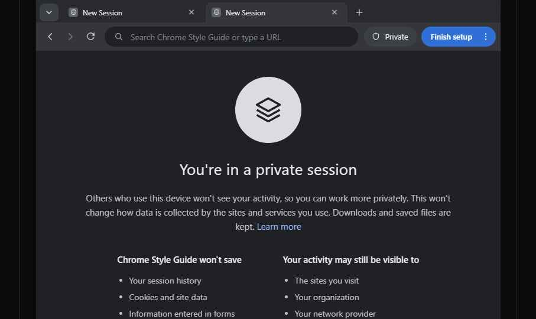
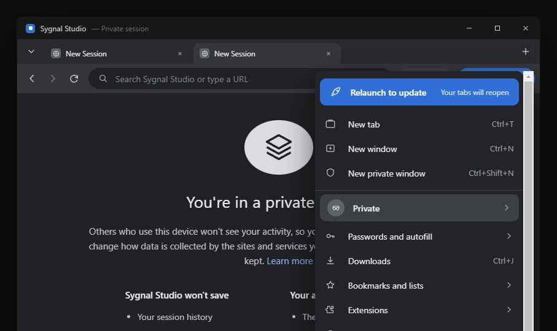
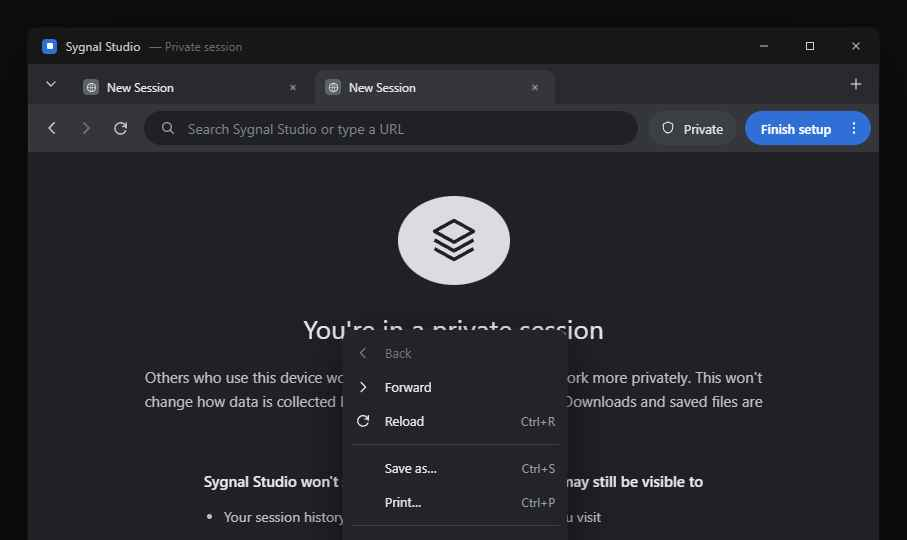
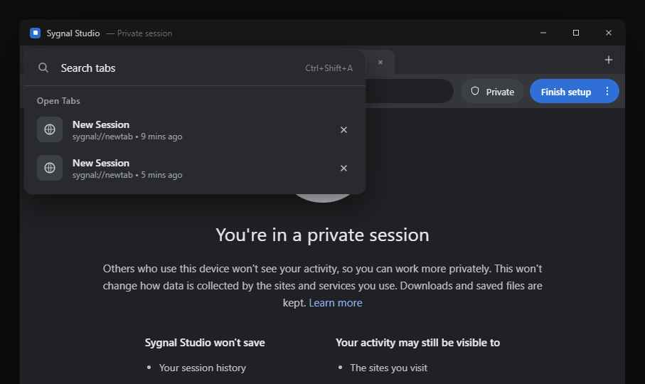

# Chrome Style Guide

The window-shell design system for a desktop app whose UI mirrors Chrome's
window chrome — **title bar, tab strip, toolbar, omnibar, menus, and overlays**.

Built primarily with **Electron** in mind, but the design is shell-agnostic: it applies
equally to **Tauri** or any web-frontend desktop shell (Wails, Neutralino, a frameless PWA).
The rendered output is pure CSS + inline SVG with no framework or platform coupling — only
two small implementation hooks differ per shell (see [Shell portability](#shell-portability)).

This is a **design / reference project**, not the app itself. It exists to define
exact tokens, measurements, states, and behavior so those components can be built
consistently in whichever shell you target.

## Preview

The full window shell — title bar, tab strip, toolbar/omnibar, and content area — in its
private-session empty state:

Overlay components share one visual language across the shell:

| App menu (kebab) | Context menu | Tab-search popup |
|---|---|---|
|  |  |  |

> These are rendered captures of the `.dc.html` sources, kept in [`assets/`](assets/) as the
> canonical README imagery. They're for illustration — `STYLE_GUIDE.md` and the `.dc.html`
> files remain authoritative on exact measurements.

## Design targets

- **Platform:** Windows-style window controls (min / max / close on the title bar).
- **Theme:** Dark only.
- **Font:** `'Segoe UI', system-ui, -apple-system, sans-serif` — no webfont; matches native rendering.
- **Accent:** `#2f6fd6`.
- **Origin:** Original design using browser-derived interaction patterns — not a clone.

## Where to start

1. **[STYLE_GUIDE.md](STYLE_GUIDE.md)** — the authoritative text spec: design tokens,
   per-component pixel measurements, states, and behavior rules. Read this before
   implementing or changing any component.
2. **`Chrome Style Guide.dc.html`** — the annotated visual style guide (embeds the live window).
3. Open the exported **`Chrome Style Guide.html`** in a browser for an offline, self-contained view.

> **Source-of-truth rule:** if a measurement in `STYLE_GUIDE.md` and the rendered
> `.dc.html` ever disagree, **the HTML wins** — fix the Markdown to match, not the reverse.

## Files

These files are **extracted from Claude design** (the DC / "omelette" tooling) and will be
re-exported into this directory as the design evolves. **Do not rename or delete them** —
the export filenames must match for re-exports to overwrite cleanly.

### Source components (edit in Claude design, not by hand)

| File | What it is |
|---|---|
| `Chrome Style Guide.dc.html` | Annotated visual style guide; embeds the live window. |
| `Chrome Style Guide Window.dc.html` | Interactive window mockup — the reusable reference. Imported by name. |
| `Chrome Style Guide Menu.dc.html` | Reusable app-menu component. Imported by name. |

The window and menu are imported into the guide **by name** (`Chrome Style Guide Window`,
`Chrome Style Guide Menu`), so those names must stay in sync with the filenames.

### Generated / exported (regenerate from the sources — don't hand-edit)

| File | What it is |
|---|---|
| `Chrome Style Guide.html` | Standalone offline bundle of the annotated guide. |
| `Chrome Style Guide -standalone-src-.html` | Standalone source variant (loads `./support.js`). |
| `Chrome Style Guide-print-1hspr19.html` | Print-optimized export. |
| `Chrome Style Guide.pdf` | PDF export of the guide. |
| `support.js` | Generated DC runtime that renders the `.dc.html` / `.html` files. |
| `.thumbnail` | WebP project thumbnail (Claude design artifact). |

### Repository imagery (versioned)

| Path | What it is |
|---|---|
| `assets/` | Curated screenshots embedded in this README (see [Preview](#preview)). Versioned — safe to reference. |

### Working artifacts (not referenced by the guide, git-ignored)

| Path | What it is |
|---|---|
| `scraps/` | Ad-hoc screenshots captured during authoring/review. Re-created on export; **not** committed. |
| `uploads/` | Images pasted into Claude design while authoring. Not committed. |

## Component overview

See [STYLE_GUIDE.md](STYLE_GUIDE.md) for the full spec. In brief:

- **Title bar** (36px) — app identity + OS window controls; the tab strip stays dedicated to tabs.
- **Tab strip** (40px) — search chevron, scrollable tab track, new-tab (+). All strip
  controls share **one vertical centerline at 23px** from the strip top.
- **Toolbar & omnibar** (48px) — nav buttons + pill omnibar; optional right-side action cluster.
- **Tab-search popup** — chevron- or `Ctrl+Shift+A`-triggered tab switcher.
- **Menus** — app menu (from the kebab) and canvas context menu, sharing one visual language.
- **Content patterns** — 820px column, empty/informational states, callouts.

### Critical invariant

Preserve the **23px tab-strip centerline**: any control added to the tab strip must be
vertically centered with the tabs (STYLE_GUIDE §4). This is the most common thing to break.

## Shell portability

The design is drawn entirely with CSS and inline SVG — no raster assets, no Node/Electron
APIs, no framework coupling in the rendered output. Everything except the window frame is
shell-agnostic. Only **two** implementation hooks are shell-specific, and both map cleanly:

| Concern | Electron | Tauri |
|---|---|---|
| Custom window frame (draw your own title bar + min/max/close) | frameless `BrowserWindow` (`frame: false`) | `decorations: false` |
| Draggable title-bar region | CSS `-webkit-app-region: drag` (and `no-drag` on the controls) | `data-tauri-drag-region` attribute on the draggable element |

`STYLE_GUIDE.md` §3 documents the title bar using Electron's `-webkit-app-region: drag`;
under Tauri, swap that hook for `data-tauri-drag-region`. Everything else — tokens,
measurements, states, tab behavior, menus, overlays — carries over unchanged.

## Editing workflow

1. Make changes to the `.dc.html` source components in Claude design (use the DC tools).
2. Keep import names in sync if any file is renamed.
3. Regenerate `Chrome Style Guide.html` (and other exports) after changing any source.
4. Update `STYLE_GUIDE.md` to match — remember the HTML is authoritative on measurements.

See [CLAUDE.md](CLAUDE.md) for the working rules used by AI assistants on this repo.
